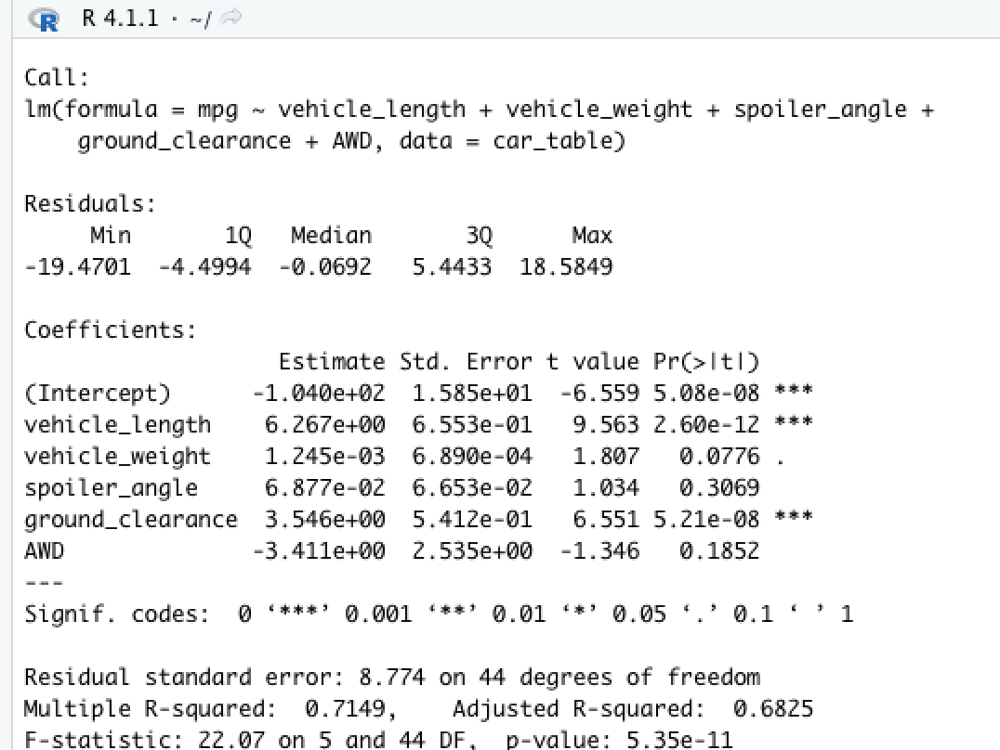
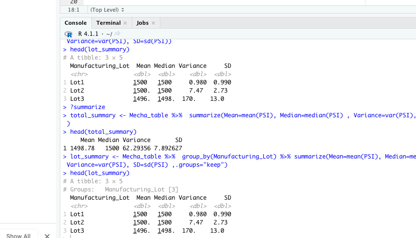
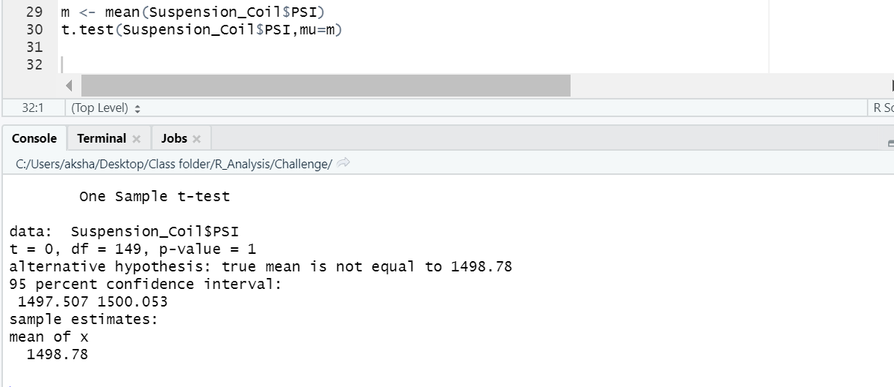
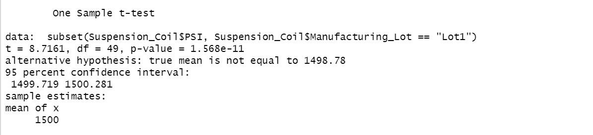
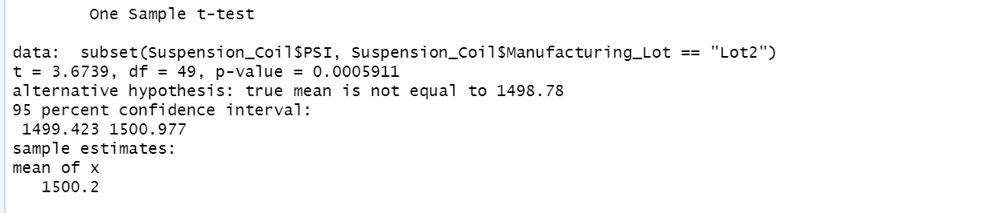
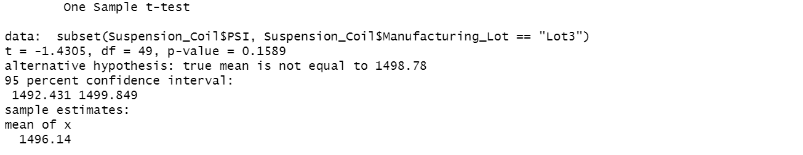

# MechaCar_Statistical_Analysis

## Linear Regression to Predict MPG


**Statistical Summary:** 

From the above output we can see that:

1. The **vehicle length**, and **vehicle ground clearance** are statistically likely to provide non-random amounts of variance to the model. That is to say, the vehicle length and vehicle ground clearance have a significant impact on miles per gallon on the MechaCar prototype. Conversely,
the **vehicle weight**, **spoiler angle**, and **All Wheel Drive** (AWD) have p-Values that indicate a random amount of variance with the dataset.  

2. The p-Value for this model, ```p-Value: 5.35e-11```, is much smaller than the assumed significance level of 0.05%. This indicates there is sufficient evidence to **reject our null hypothesis**, which further indcates that the slope of this linear model is **not zero**.


3.  This linear model has an r-squared value of 0.7149, which means that approximately 71% of all mpg predictions will be determined by this model. Relatively speaking, his multiple regression model **does predict mpg of MechaCar prototypes effectively**. 

If we remove the less impactful independent variables (vehicle weight, spoiler angle, and All Wheel Drive), the predictability does decrease, but not drastically: the r-squared value falls from 0.7149 to 0.674.




## Summary Statistics on

When looking at the entire population of the production lot, the variance of the coils is 62.29 PSI, which is well within the 100 PSI variance requirement.
Similarly, but significantly more consistent, Lot 1 and Lot 2 are well within the 100 PSI variance requirement; with variances of 0.98 and 7.47 respectively. However, it is Lot 3 that is showing much larger variance in performance and consistency, with a variance of 170.29. It is Lot 3 that is disproportionately causing the variance at the full lot level.




## T-Tests on Suspension Coils
We will perform t-tests to determine if all manufacturing lots and each lot individually are statistically different from the population mean of 1,500 pounds per square inch.
### A. To Determine if the PSI across all manufacturing lots is statistically different from the population mean of 1,500 pounds per square inch.
The p value is 1 which is greater than 0.05 and is therfore not significant and the null hypothesis can be accepted



### B. To Determine if the PSI for each manufacturing lot is statistically different from the population mean of 1,500 pounds per square inch.
#### 1. Lot 1
The p value is 1.568e-11 which is greater than 0.05 and is therfore not significant and the null hypothesis can be accepted.



#### 2. Lot 2
The p value is 0.0005911 which is less than 0.05 and is therfore significant so the null hypothesis can be rejected.



#### 3. Lot 3
The p value is 0.1589 which is greater than 0.05 and is therfore not significant so the null hypothesis can be accepted



Looking at the p value for all the manufacturing lots together is greater than 0.05 and is not significant so the null hypothesis can be accepted.Similarly the null hypothesis for lot1 and lot 3 can also be accepted as the p values are also greater that 0.05. The null hypothesis for lot2 can be rejected as the p value is less than 0.05 


## Study Design: MechaCar vs Competition

The various comparable factors that MechaCar can perform against the competition would be cost,highway fuel efficiency, horse power, maintenance cost,seating capacity,PSI, mpg,ground clearence,fuel type,safety rating etc.

##### 1. We can test the highway fuel efficiency,horse power and cost.Since these metrics are directly proportional we can justify the cost of vehicle comparing to the competition.
##### 2. The null hypothesis is a statement of no difference between a sample mean or proportion and a population mean or proportion. The alternative hypothesis is a contradictory to the null hypothesis.The mean of metricA from the MechaCar can be equal or different than the mean of metricA from the competition.Using the t test we can calculate the p value and depending on this p value we can reject our null hypothesis if p value is smaller than 0.05 and support the alternative hypothesis or accept the null hypothesis and reject the alternative hypothesis.
##### 3. Since we are comparing the means from two populations we can use two sample t test. Further as we want to know whether one population mean is greater than or less than the other, we can perform a one-tailed t-test.
##### 4. The following data is needed to run the statistical test
		a. The mean of both samples
		b. The standard deviation of both samples
		c. The number of observations
